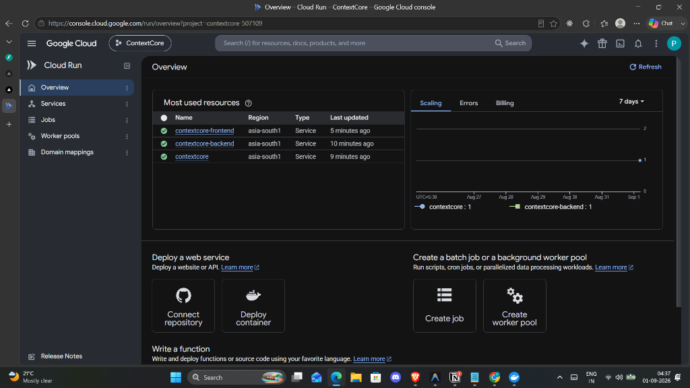

# ContextCore - AI Coding Partner

ContextCore is a persistent-memory AI coding partner that learns your codebase and remembers your team’s coding conventions—so you don’t have to repeat them.
 

## The Problem

Every LLM coding assistant today has the same failure mode: it's brilliant and
then it forgets.

- **Context window amnesia** — you explain your auth pattern, naming
  conventions, and architectural decisions in every single session. The model
  never carries it forward.
- **Codebase scale exceeds context** — a real repo is 50k–500k lines. You
  can't paste it all into a prompt every time.
- **Enterprise trust = reliability, not cleverness** — enterprises don't adopt
  agents because they're smart once; they adopt them when they don't lose
  work, don't repeat mistakes, and don't silently die mid-task.

ContextCore is a proof-of-concept that a memory layer — not a smarter model —
is what turns a coding assistant into a coding *partner*.

## Who this is for

- Engineering teams onboarding AI pair-programmers into large legacy codebases
- Consultancies juggling many client repos, each with different conventions
- Platform teams evaluating whether to build an in-house coding agent or buy one

# Architecture Diagram


---

## Core Loop

1. **Onboard** a GitHub repo → chunked by function/class → embedded → indexed
2. **Chat** with the agent about the codebase → it retrieves relevant context
   from long-term memory before answering
3. **Correct** the agent → the correction is persisted permanently, not just
   for this session
4. **Ask again** → the agent applies the correction automatically, with no
   reminder
5. **If the process crashes mid-task** → it resumes from the last checkpoint,
   no lost work
6. **Cost dashboard** → shows Flash vs. Pro model usage and real-time
   estimated spend

---


---

## 🏗 Tech Stack 
| Layer | Technology | Purpose |
|---|---|---|
| **Frontend** | Next.js 14 + shadcn/ui + Tailwind | Developer workspace |
| **Backend** | FastAPI + Google ADK 2.0 | Agent orchestration |
| **LLM** | Gemini 3.5 Flash / Pro | Code generation & reasoning |
| **Embeddings** | Gemini Embedding-001 | Code embeddings |
| **Vector DB** | Vertex AI Vector Search | Semantic code retrieval |
| **State** | Firestore | Persistent memory & checkpoints |
| **Hosting** | Cloud Run | Google Cloud deployment |
| **Auth** | GitHub Personal Access Token | Repository access |
| **Visualization** | Recharts | Memory & cost visualization |


## 🚀 Key Features

*   **Persistent Team Memory:** Automatically detects corrections in chat, classifies them (auth, styling, naming, etc.), and stores them in Cloud Firestore. These rules are injected into every future prompt.
*   **Smart Model Routing:** Dynamically routes queries to **Gemini 3.5 Pro** for architectural changes or **Gemini 3.5 Flash** for lookups, significantly reducing API costs.
*   **AST-Based Code Ingestion:** Uses an Abstract Syntax Tree (AST) parser and text chunker to ensure code is indexed with semantic meaning rather than just raw text.
*   **Real-time Context Visibility:** The UI shows you exactly which "Memory Nodes" are being used to generate a response, providing transparency into the AI's "thought process."

## Cost-aware routing

Routing is a simple, explainable, hardcoded rule — not a learned classifier:

Flash: explain / summarize / retrieve / general questions
Pro: generate / refactor / architect / implement / build / design

Every call is logged to Firestore with an estimated token count and cost, surfaced live in the Session Usage panel.


## Reliability model

Before every step of the coordinator loop (memory retrieval, model selection,
generation), state is checkpointed to Firestore keyed by `session_id + step`.
On the next request for that session, the backend checks for an incomplete
prior checkpoint and can resume rather than restart from zero — this is what
"self-healing" means in practice here: not automatic error correction, but
never losing already-completed work when a process dies.

---

## Setup

### 1. GCP project
- Enable APIs: Vertex AI / Agent Platform, Cloud Firestore, Cloud Run
- Create a Firestore database (Native mode), region `asia-south1`
- Create a Vertex AI Vector Search index (768 dims, Streaming update method),
  create an Index Endpoint (Public), deploy the index to it
- Auth locally with `gcloud auth application-default login` — no service
  account JSON key needed (and typically blocked by org policy on new
  projects anyway)

### 2. Backend
```bash
cd backend
pip install -r requirements.txt
cp .env.example .env   # fill in project ID, region, index/endpoint IDs, Gemini API key, GitHub PAT
uvicorn main:app --reload --port 8000
```

### 3. Frontend
```bash
cd frontend
npm install
echo "NEXT_PUBLIC_API_URL=http://localhost:8000" > .env.local
npm run dev
```

### 4. Deploy to Google Cloud Run
```bash
gcloud run deploy contextcore-backend --source ./backend --region asia-south1 --allow-unauthenticated
gcloud run deploy contextcore-frontend --source ./frontend --region asia-south1 --allow-unauthenticated
```

#### 🌐 Live Google Cloud Run Deployment


Both `contextcore-backend` and `contextcore-frontend` are running live on Google Cloud Run (`asia-south1`).


---


---

## 📂 Directory Structure

```text
ContextCore/
├── backend/                  # FastAPI Backend Service
│   ├── agents/               # Memory, Coordinator, and Architect Agents
│   ├── services/             # API connections (Gemini, Firestore, Vertex)
│   ├── tools/                # Git Cloner, AST Parsers, and Chunkers
│   ├── main.py               # API Endpoints (/chat, /ingest, /memory, /costs)
│   └── requirements.txt      # Python dependencies
│
├── frontend/                 # Next.js Frontend Client (App Router)
│   ├── app/                  # Workspace and Memory Inspector views
│   ├── components/           # Recharts dashboards and Chat UI
│   ├── tailwind.config.ts    # Design system and theme
│   └── package.json          # Node dependencies
```

---

## 🔄 Data Flow (High Level)

1.  **Developer:** Sends a message or triggers a repository ingestion via the UI.
2.  **Backend APIs:** Receive the request and trigger the **Coordinator Agent**.
3.  **Agents:** The **Memory Agent** retrieves relevant code and rules; the **Architect Agent** decides the generation path.
4.  **Services:** The system calls Gemini, Vertex Search, and Firestore to gather context and generate the code.
5.  **Response:** The final output is streamed back to the Workspace UI via SSE/WebSockets for a real-time experience.

---

## 📊 API Endpoints

| Method | Endpoint | Description |
| :--- | :--- | :--- |
| `POST` | `/chat` | Core interaction endpoint. Coordinates memory and generation. |
| `POST` | `/ingest` | Clones, parses, and indexes a GitHub repo into Vector Search. |
| `GET` | `/memory` | Retrieve the list of permanent team conventions and rules. |
| `GET` | `/costs` | Fetch real-time token usage and spend statistics. |

---

## Future scope (v1)

- GitHub PR creation
- Slack integration
- Real-time multi-user collaboration

These are natural v2 extensions once the core memory/reliability/cost loop is proven.
