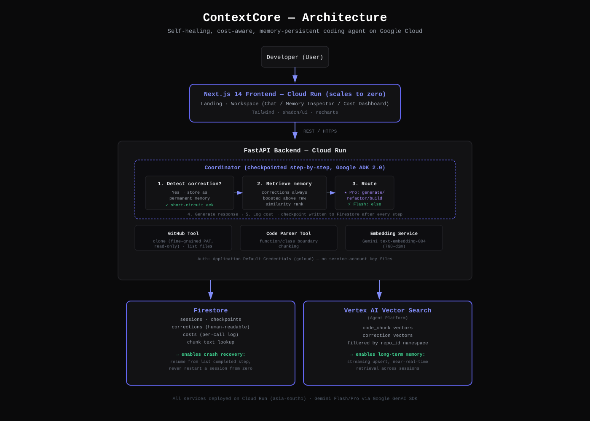

# ContextCore | Persistent Memory AI Coding Partner

ContextCore is a technical coding agent featuring long-term repository memory. By indexing source code files into semantic vector search spaces and recording team-specific corrections and architectural conventions into a persistent store (Firestore), ContextCore ensures that AI code generation adheres strictly to your codebase's established rules and patterns rather than generic standards.



---

## Key Features
*   **Vector Search Code Indexing:** Chunks, parses, and embeds repository source code into vectors, supporting local fallback database queries and Cloud Vector Search indexes.
*   **Persistent Team Memory:** Detects verbal corrections in chat (e.g. *"Actually, we use CamelCase instead of snake_case"*), classifies the topic (auth, styling, naming, database, routing, etc.), and stores it permanently.
*   **Cost & Model Routing:** Automatically predicts query complexity and routes queries dynamically between Gemini Pro (for architectural changes) and Gemini Flash (for simpler lookups), while compiling real-time costs and call statistics.
*   **Three-Panel Developer Interface:**
    *   **Left Sidebar:** Navigational tabs for Workspace, Memory Nodes, Costs, GitHub linkages, and Deployments.
    *   **Center Panel:** Interactive chat feed equipped with code block syntax cards, file-path highlighting, thinking pulses, and repository ingestion controls.
    *   **Right Sidebar (Inspector Panel):** Renders active memory nodes in real-time (highlighting nodes referenced in the current response), session usages via a Recharts donut breakdown, and active context file lists.

---

## Directory Structure

```text
ContextCore/
├── backend/                  # FastAPI Backend Service
│   ├── agents/               # Memory and Coordinator Agents
│   │   ├── coordinator.py    # Directs message flow, checkpoints, and costs
│   │   ├── memory_agent.py   # Code context retriever & correction manager
│   │   └── architect_agent.py# Code generator instruction model
│   ├── services/             # API connections (Google GenAI, Firestore, Vector store)
│   ├── tools/                # Cloners and AST code parsers
│   ├── main.py               # API endpoints (/chat, /ingest, /memory, /costs)
│   └── requirements.txt      # Python dependencies
│
├── frontend/                 # Next.js Frontend Client (App Router)
│   ├── app/
│   │   ├── workspace/        # Three-Panel Workspace Interface
│   │   ├── memory/           # Memory Node Inspector and Filter Board
│   │   ├── layout.tsx        # Inter and JetBrains Mono Google Font bindings
│   │   └── page.tsx          # Landing/Hero page
│   ├── tailwind.config.ts    # Design system colors and variables configuration
│   └── package.json          # Node dependencies (recharts, lucide-react, next)
```

---

## Installation & Setup

### Prerequisites
*   Python 3.10+
*   Node.js 18+
*   Google GenAI / Gemini API Credentials
*   Google Cloud Platform Project with Firestore & Vector Search setup

### 1. Backend Setup

1.  Navigate into the `backend/` directory:
    ```bash
    cd backend
    ```
2.  Install python packages:
    ```bash
    pip install -r requirements.txt
    ```
3.  Set up your environment variables. Duplicate `.env.example` as `.env` and fill in your keys:
    ```ini
    GEMINI_API_KEY="your-gemini-api-key"
    GOOGLE_CLOUD_PROJECT="your-project-id"
    VECTOR_SEARCH_INDEX="your-index-id"
    VECTOR_SEARCH_ENDPOINT="your-endpoint-id"
    ```
4.  Start the FastAPI backend server:
    ```bash
    uvicorn main:app --reload --port 8000
    ```

### 2. Frontend Setup

1.  Navigate into the `frontend/` directory:
    ```bash
    cd ../frontend
    ```
2.  Install npm packages:
    ```bash
    npm install
    ```
3.  Create a `.env.local` file pointing to your running backend:
    ```ini
    NEXT_PUBLIC_API_URL=http://localhost:8000
    ```
4.  Launch the development server:
    ```bash
    npm run dev
    ```
5.  Open your browser and navigate to: **`http://localhost:3000`**

---

## API Endpoints Reference

| Method | Endpoint | Description |
| :--- | :--- | :--- |
| `GET` | `/health` | Check backend service connectivity. |
| `POST`| `/ingest` | Download and index code files from GitHub into memory databases. |
| `POST`| `/chat` | Chat with ContextCore. Coordinates vector lookups, loads rules, and records costs. |
| `POST`| `/query` | Search vector spaces for code blocks semantically related to queries. |
| `GET` | `/memory/{repo_id}` | Retrieve stored team corrections/conventions for a given repo. |
| `GET` | `/costs` | Retrieve token usage counters and estimated model call spends. |

---

## How In-Context Memory Training Works

To teach ContextCore a new convention during your chat session:
1.  Use warning/correction syntax indicators in your message like:
    *   *"Actually, we use JWT tokens instead of sessions."*
    *   *"We use camelCase conventions for all route handlers."*
2.  ContextCore automatically matches these indicators, extracts the topic, and stores it in your Firestore memory pool.
3.  In all future workspace prompts, these rules are loaded as high-priority constraints in the system prompt.
